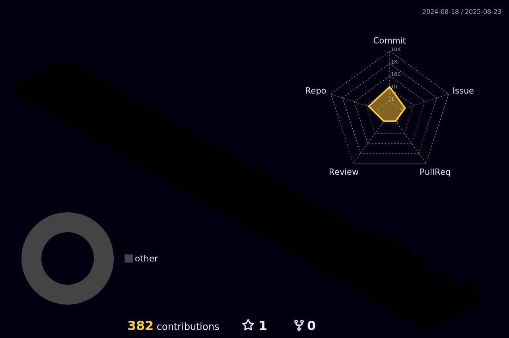

  
  
  

    ⭐⭐⭐⭐⭐ <strong>4.8/5</strong> <em>(19 reviews)</em>
  

  
  

    
    
  

---

## About Me

I'm a developer specializing in **Large Language Model agents** and **Retrieval-Augmented Generation** systems

## Tech Stack

  
  
  
  
  
  
  
  
  
  
  
  
  
  

## GitHub Activity

  

## Support

  
  

